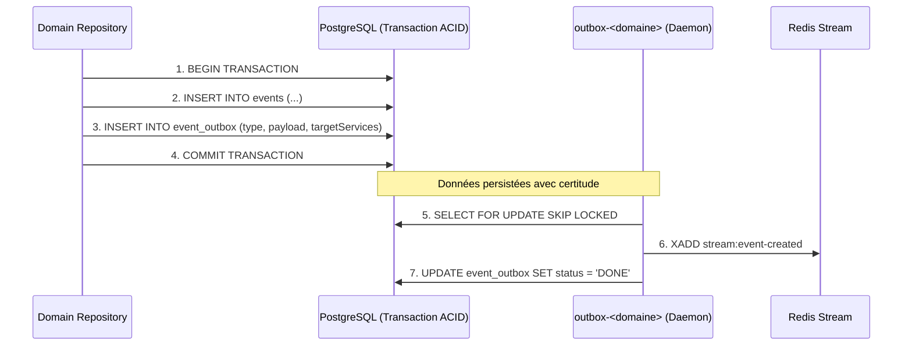

# Deep-Dive : Étape 2 - Transactional Outbox & Émission BDD

Ce document détaille l'implémentation de l'émission transactionnelle dans PostgreSQL depuis les packages [`domain-*`](file:///Users/victoragahi/Developer/meta/npm-packages/packages) et les microservices [`ms-*`](file:///Users/victoragahi/Developer/meta).

---

## 1. Pourquoi le Transactional Outbox ?

Dans une architecture distribuée, **écrire dans PostgreSQL puis appeler Redis directement est un anti-pattern** majeur (problème du "Dual Write") :
- Si Redis plante ou subit un timeout réseau après le commit SQL, le message est perdu à jamais.
- Si le commit SQL échoue après l'envoi Redis, des consommateurs traitent un événement inexistant en base.

**La solution Volontariapp :**
Le message est écrit **dans la même transaction ACID PostgreSQL** que les données métiers. L'écriture en base de l'entité métier et de l'événement Outbox réussissent ensemble ou échouent ensemble.



---

## 2. Implémentation dans un Repository de Domaine

Emplacement standard : `npm-packages/packages/domain-<domaine>/src/repositories/postgres-<entite>.repository.ts`.

```typescript
import { Injectable } from '@nestjs/common';
import { InjectRepository } from '@nestjs/typeorm';
import type { Repository } from '@volontariapp/database';
import { BaseRepository, EventQueueEntity, EventQueueModel } from '@volontariapp/database';
import { EventQueueRepository } from '@volontariapp/outbox';
import { Streams } from '@volontariapp/shared';
import { EventEventMessagingType, IEventPublishedPayload } from '@volontariapp/messaging';
import { EventModel } from '../models/event.model.js';
import { EventEntity } from '../entities/event.entity.js';

@Injectable()
export class PostgresEventRepository extends BaseRepository<EventModel, EventEntity> {
  constructor(
    @InjectRepository(EventModel)
    repository: Repository<EventModel>,
  ) {
    super(repository, EventEntity, EventModel);
  }

  async publishEvent(eventId: string, organizerId: string): Promise<EventEntity> {
    return this.executeInTransaction(async (queryRunner) => {
      // 1. Mise à jour de l'état métier
      const model = await queryRunner.manager.findOne(this.modelClass, { where: { id: eventId } });
      if (!model) {
        throw new Error(`Event ${eventId} introuvable`);
      }
      model.status = 'PUBLISHED';
      const savedModel = await queryRunner.manager.save(this.modelClass, model);
      const entity = this.toEntity(savedModel);

      // 2. Préparation du payload typé
      const payload: IEventPublishedPayload = {
        eventId: entity.id,
        organizerId,
        publishedAt: new Date().toISOString(),
        tags: entity.tags ?? [],
      };

      // 3. Instanciation de l'événement Outbox
      const eventQueueEntity = EventQueueEntity.createEvent<EventEventMessagingType.EVENT_PUBLISHED>({
        type: EventEventMessagingType.EVENT_PUBLISHED,
        emitter: 'ms-event',
        emitterId: organizerId,
        payload,
        targetServices: [Streams.EVENT_PUBLISHED],
      });

      // 4. Écriture dans event_outbox dans la transaction du queryRunner
      const eventQueueRepo = new EventQueueRepository<EventEventMessagingType.EVENT_PUBLISHED>(
        queryRunner.manager.getRepository<EventQueueModel>(EventQueueModel),
      );
      await eventQueueRepo.create(eventQueueEntity);

      return entity;
    });
  }
}
```

---

## 3. Distinction Cruciale : `EventQueueEntity` (Event) vs `JobsOutboxEntity` (Job)

| Propriété | `EventQueueEntity` (Event) | `JobsOutboxEntity` (Job) |
| :--- | :--- | :--- |
| **Cardinalité** | **1 : N** (Diffusé à de multiples listeners) | **1 : 1** (Exécuté par un seul worker) |
| **Table BDD** | `event_outbox` | `jobs_outbox` |
| **Destination** | **Redis Streams** (`targetServices: [Streams.XYZ]`) | **BullMQ Queue** (`target: EventsQueue.EVENTS`) |
| **Consommateur** | `post-processors-runner` / `ws-service` | `workers-runners` |
| **Cas d'usage** | Événement métier, synchro multi-services | Tâche de fond lourde, envoi d'email, fallback |

### Exemple pour un Job Outbox (Fallback ou Tâche) :
```typescript
import { JobsOutboxEntity, JobsOutboxModel } from '@volontariapp/database';
import { JobsOutboxRepository } from '@volontariapp/outbox';
import { EventsQueue, JobMessagingType } from '@volontariapp/messaging';

const job = JobsOutboxEntity.createJob<typeof JobMessagingType.PUBLISH_EVENT>({
  type: JobMessagingType.PUBLISH_EVENT,
  emitter: 'ms-event',
  emitterId: userId,
  scheduledAt: new Date(),
  target: EventsQueue.EVENTS,
  payload: { eventId, creatorId: userId },
});

const jobsRepo = new JobsOutboxRepository(queryRunner.manager.getRepository(JobsOutboxModel));
await jobsRepo.create(job);
```

---

## 4. Fonctionnement du Démon `outbox-runners`

Vous n'avez **aucun code à écrire** dans `outbox-runners`. Le processus tourne en boucle autonome :
1. Polling via `SELECT * FROM event_outbox WHERE status = 'pending' FOR UPDATE SKIP LOCKED LIMIT 50`.
2. Pousse le batch vers Redis Stream avec `XADD`.
3. Passe le statut à `done` ou `failed` avec retry exponentiel.
4. Aucun verrou bloquant entre plusieurs instances grâce à `SKIP LOCKED`.
