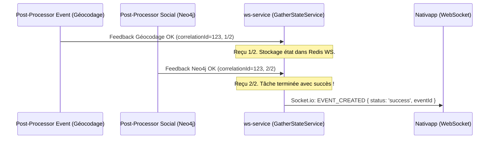

# Deep-Dive : Étape 4 - Scatter-Gather & Passerelle WebSocket (`ws-service`)

Ce document détaille l'orchestration du pattern **Scatter-Gather** et la notification en temps réel vers le client mobile/web dans [`ws-service`](file:///Users/victoragahi/Developer/meta/ws-service).

---

## 1. Qu'est-ce que le Scatter-Gather ?

Lorsqu'une action utilisateur nécessite plusieurs opérations asynchrones indépendantes (ex: Création d'événement = Géocodage + Ingestion Neo4j) :

- **Scatter (Éparpillement)** : Le microservice émet un seul événement. Deux (ou plus) post-processors indépendants l'exécutent en parallèle.
- **Gather (Rassemblement)** : Le `ws-service` écoute les flux de retour de chaque processeur, agrège les résultats pour un même `correlationId`, et ne prévient l'utilisateur qu'une fois la totalité des tâches terminée.



---

## 2. Le Rôle du `GatherStateService` dans `ws-service`

Le `ws-service` utilise son **Redis dédié** (`db_redis_ws`) pour stocker l'état éphémère de corrélation avec un TTL automatique (ex: 60 secondes) pour éviter les fuites de mémoire.

Emplacement type : `ws-service/src/core/services/gather-state.service.ts`.

### Logique d'agrégation :
```typescript
@Injectable()
export class GatherStateService {
  constructor(@Inject('REDIS_WS_CLIENT') private readonly redis: Redis) {}

  /**
   * Incrémente le compteur de retours reçus pour un identifiant de corrélation
   */
  async recordStep(correlationId: string, expectedCount: number = 2): Promise<{ isComplete: boolean; count: number }> {
    const key = `gather:${correlationId}`;
    const current = await this.redis.incr(key);
    
    // Définition d'un TTL de sécurité
    if (current === 1) {
      await this.redis.expire(key, 60);
    }

    return {
      isComplete: current >= expectedCount,
      count: current,
    };
  }

  async clearState(correlationId: string): Promise<void> {
    await this.redis.del(`gather:${correlationId}`);
  }
}
```

---

## 3. Implémentation du Post-Processor dans `ws-service`

Le `ws-service` héberge ses propres post-processors qui écoutent les flux de feedback (`ws-service/src/post-processors/events/`) :

```typescript
import { Injectable } from '@nestjs/common';
import { EventEventMessagingType, WebsocketMessagingType } from '@volontariapp/messaging';
import { GatherStateService } from '../../core/services/gather-state.service.js';
import { WsGateway } from '../../gateways/ws.gateway.js';

@Injectable()
export class EventFeedbackPostProcessor {
  constructor(
    private readonly gatherState: GatherStateService,
    private readonly wsGateway: WsGateway,
  ) {}

  async handleFeedback(correlationId: string, userId: string, payload: any): Promise<void> {
    // 1. Incrémenter l'état (ex: on attend 2 retours : géocodage + social)
    const { isComplete } = await this.gatherState.recordStep(correlationId, 2);

    if (isComplete) {
      // 2. Nettoyage de l'état temporaire
      await this.gatherState.clearState(correlationId);

      // 3. Émission sur la socket ciblée de l'utilisateur
      this.wsGateway.emitToUser(userId, WebsocketMessagingType.EVENT_CREATED, {
        correlationId,
        status: 'success',
        data: payload,
      });
    }
  }

  async handleFailure(correlationId: string, userId: string, errorMessage: string): Promise<void> {
    await this.gatherState.clearState(correlationId);

    // Notification immédiate de l'échec au client
    this.wsGateway.emitToUser(userId, WebsocketMessagingType.EVENT_CREATED, {
      correlationId,
      status: 'error',
      message: errorMessage,
    });
  }
}
```

---

## 4. Sécurité WebSocket & Authentification Interne

Rappel issu de [C2-Containers.md](file:///Users/victoragahi/Developer/meta/docs/C2-Containers.md) :
- Le `ws-service` n'est **jamais exposé directement** sur Internet.
- L'**API Gateway** intercepte les requêtes de handshake (`/socket.io`), valide le JWT OAuth, et injecte un header `x-internal-token`.
- Le `ws-service` vérifie ce token interne de façon purement cryptographique (ultra-rapide, zéro requête BDD) et associe la socket à l'`userId`.
