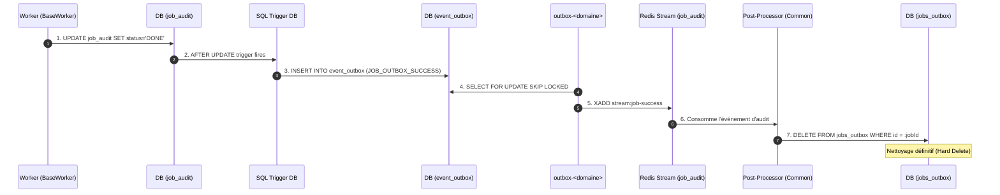

# Deep-Dive : Étape 4 - La Boucle d'Audit et le SQL Trigger

Ce document détaille la machinerie interne qui garantit la résilience absolue des jobs dans Volontariapp (la **Audit Loop** décrite dans [C3-Async-Patterns-And-Flows.md](file:///Users/victoragahi/Developer/meta/docs/C3-Async-Patterns-And-Flows.md)).

---

## 1. Le Cycle Complet de l'Audit Loop

Pourquoi ne supprime-t-on pas le job dès que le worker a fini ?
Parce que si le réseau ou la base de données crash pendant l'acquittement, l'information d'exécution serait perdue.



---

## 2. Le Trigger SQL PostgreSQL

Dans chaque base PostgreSQL de microservice, la migration initiale configure un trigger SQL sur la table `job_audit` :

```sql
CREATE OR REPLACE FUNCTION notify_job_audit_change()
RETURNS TRIGGER AS $$
BEGIN
    IF (NEW.status = 'done') THEN
        INSERT INTO event_outbox (id, type, emitter, payload, target_services, status)
        VALUES (
            gen_random_uuid(),
            'common.job_outbox_success',
            NEW.worker_id,
            json_build_object('jobId', NEW.job_id, 'status', NEW.status),
            ARRAY['stream:job-success'],
            'pending'
        );
    ELSIF (NEW.status = 'failed') THEN
        INSERT INTO event_outbox (id, type, emitter, payload, target_services, status)
        VALUES (
            gen_random_uuid(),
            'common.job_outbox_failed',
            NEW.worker_id,
            json_build_object('jobId', NEW.job_id, 'status', NEW.status, 'error', NEW.error),
            ARRAY['stream:job-failed'],
            'pending'
        );
    END IF;
    RETURN NEW;
END;
$$ LANGUAGE plpgsql;

CREATE TRIGGER trigger_job_audit_outbox
AFTER UPDATE ON job_audit
FOR EACH ROW
WHEN (OLD.status IS DISTINCT FROM NEW.status AND NEW.status IN ('done', 'failed'))
EXECUTE FUNCTION notify_job_audit_change();
```

---

## 3. Le Post-Processor de Nettoyage

La bibliothèque [`@volontariapp/post-processors`](file:///Users/victoragahi/Developer/meta/npm-packages/packages/post-processors) intègre les processeurs génériques qui écoutent ce stream pour nettoyer la table d'origine `jobs_outbox` :

```typescript
// Exemple dans post-processors (commun) :
export class JobOutboxSuccessPostProcessor extends SinglePostProcessor {
  async processEvent(event: JobAuditEvent) {
    const { jobId } = event.payload;
    // Suppression définitive de la ligne pending/processing d'origine
    await this.jobsOutboxRepo.hardDelete(jobId);
  }
}
```

---

## 4. Guide de Dépannage (Troubleshooting)

Si la table `jobs_outbox` s'accumule sans jamais se vider :
1. **Vérifier `job_audit`** : Le statut passe-t-il bien à `done` ? Si non, le handler a planté sans lever d'erreur ou le worker est bloqué.
2. **Vérifier `event_outbox`** : Une ligne `common.job_outbox_success` a-t-elle été générée ? Si non, le trigger SQL PostgreSQL est manquant ou désactivé sur la base.
3. **Vérifier l'Outbox Runner** : Le runner lit-il bien `event_outbox` pour pousser vers Redis ?
4. **Vérifier le Post-Processor** : Le processeur qui effectue le `hardDelete` est-il actif et connecté au bon stream ?
