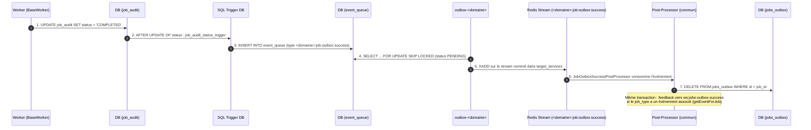

# Deep-Dive : Étape 4 - La Boucle d'Audit et le SQL Trigger

Ce document détaille la machinerie interne qui garantit la résilience des jobs dans Volontariapp (la **Audit Loop** décrite dans [C3-Async-Patterns-And-Flows.md](file:///Users/victoragahi/Developer/meta/docs/C3-Async-Patterns-And-Flows.md)). Tout ce qui suit est tiré des migrations communes (`src/migrations/common/` de chaque service) et de `@volontariapp/post-processors`.

---

## 1. Le Cycle Complet de l'Audit Loop

Pourquoi ne supprime-t-on pas le job dès que le worker a fini ?
Parce que si le réseau ou la base de données crash pendant l'acquittement, l'information d'exécution serait perdue.


```mermaid
sequenceDiagram
    autonumber
    participant WORKER as Worker (BaseWorker)
    participant DB_AUD as DB (job_audit)
    participant TRIGGER as SQL Trigger DB
    participant DB_EVT as DB (event_queue)
    participant OUTBOX as outbox-<domaine>
    participant STREAM as Redis Stream (<domaine>:job:outbox:success)
    participant PP as Post-Processor (commun)
    participant DB_JOBS as DB (jobs_outbox)

    WORKER->>DB_AUD: 1. UPDATE job_audit SET status = 'COMPLETED'
    DB_AUD->>TRIGGER: 2. AFTER UPDATE OF status : job_audit_status_trigger
    TRIGGER->>DB_EVT: 3. INSERT INTO event_queue (type <domaine>:job:outbox:success)
    OUTBOX->>DB_EVT: 4. SELECT ... FOR UPDATE SKIP LOCKED (status PENDING)
    OUTBOX->>STREAM: 5. XADD sur le stream nommé dans target_services
    STREAM->>PP: 6. JobOutboxSuccessPostProcessor consomme l'événement
    PP->>DB_JOBS: 7. DELETE FROM jobs_outbox WHERE id = job_id
    Note over PP: Même transaction : feedback vers ws:jobs-outbox-success<br/>si le job_type a un événement associé (getEventForJob)
```

Statuts utilisés :

- `job_audit.status` (enum `JobAuditStatus`, `@volontariapp/database`) : `PENDING`, `PROCESSING`, `COMPLETED`, `FAILED`.
- `jobs_outbox.status` et `event_queue.status` (enum `OutboxStatus`) : `PENDING`, `PROCESSING`, `COMPLETED`, `FAILED`.

---

## 2. Le Trigger SQL PostgreSQL

Chaque base de microservice porte la même fonction, créée et mise à jour par les migrations communes. Version courante (`FixJobAuditTriggerTargetServices1781300000000`) :

```sql
CREATE OR REPLACE FUNCTION notify_job_audit_status_change()
RETURNS TRIGGER AS $$
DECLARE
  stream_prefix text;
  event_type text;
BEGIN
  stream_prefix := replace(NEW.emitter, 'ms-', '');
  IF NEW.status = 'COMPLETED' THEN
    event_type := stream_prefix || ':job:outbox:success';
    INSERT INTO event_queue (type, emitter, "emitterId", payload, version, updated_at, target_services)
    VALUES (
      event_type,
      NEW.emitter,
      NEW.job_id::uuid,
      jsonb_build_object('before', to_jsonb(OLD), 'after', to_jsonb(NEW)),
      1,
      now(),
      ARRAY[event_type]
    );
  ELSIF NEW.status = 'FAILED' THEN
    event_type := stream_prefix || ':job:outbox:failure';
    INSERT INTO event_queue (type, emitter, "emitterId", payload, version, updated_at, target_services)
    VALUES (
      event_type,
      NEW.emitter,
      NEW.job_id::uuid,
      jsonb_build_object('before', to_jsonb(OLD), 'after', to_jsonb(NEW)),
      1,
      now(),
      ARRAY[event_type]
    );
  END IF;
  RETURN NEW;
END;
$$ LANGUAGE plpgsql;

CREATE TRIGGER job_audit_status_trigger
AFTER UPDATE OF status ON job_audit
FOR EACH ROW
EXECUTE FUNCTION notify_job_audit_status_change();
```

Points clés :

- Le préfixe vient de `job_audit.emitter` : un job émis par `ms-event` produit `event:job:outbox:success` ou `event:job:outbox:failure`.
- Le type d'événement **est** le nom du stream cible (`target_services = ARRAY[event_type]`). Les streams correspondants sont déclarés dans l'enum `Streams` (`@volontariapp/shared`), par exemple `EVENT_JOB_OUTBOX_SUCCESS`.
- Le payload contient l'état complet de la ligne `job_audit` avant et après (`before` / `after`), dont `job_id`, `job_type` et `result_payload`.

---

## 3. Les Post-Processors de Nettoyage

[`@volontariapp/post-processors`](file:///Users/victoragahi/Developer/meta/npm-packages/packages/post-processors) fournit deux processeurs génériques (`src/common/`), branchés dans chaque `post-processor-<domaine>` :

| Processeur | Types acceptés (`shouldProcess`) | Action |
| :--- | :--- | :--- |
| `JobOutboxSuccessPostProcessor` (`BatchPostProcessor`) | `job.outbox.success` ou `*:job:outbox:success` | Dans une transaction : `DELETE` de la ligne `jobs_outbox`, puis événement de feedback vers `Streams.WS_JOBS_OUTBOX_SUCCESS` si `getEventForJob(job_type)` connaît le job et que `result_payload.originalPayload` est présent. |
| `JobOutboxFailedPostProcessor` (`BatchPostProcessor`) | `job.outbox.failed` ou `*:job:outbox:failed` | `jobs_outbox.status` `PENDING` vers `FAILED`, puis feedback vers `Streams.WS_JOBS_OUTBOX_FAILURE`. |

> [!WARNING]
> **Bug connu** : le trigger émet `<domaine>:job:outbox:failure`, alors que `JobOutboxFailedPostProcessor.shouldProcess` attend un suffixe `:job:outbox:failed`. Les événements d'échec sont donc ignorés : le job reste `PENDING` dans `jobs_outbox` et aucun feedback d'échec n'est émis. La correction relève de `npm-packages` (règle du STOP).

---

## 4. Guide de Dépannage (Troubleshooting)

Si la table `jobs_outbox` s'accumule sans jamais se vider :
1. **Vérifier `job_audit`** : le statut passe-t-il bien à `COMPLETED` ? S'il reste `PROCESSING`, le handler est bloqué ou le worker a crashé. S'il est `FAILED`, voir le bug connu ci-dessus.
2. **Vérifier `event_queue`** : une ligne de type `<domaine>:job:outbox:success` a-t-elle été générée ? Si non, le trigger `job_audit_status_trigger` est manquant ou désactivé sur la base.
3. **Vérifier l'Outbox Runner** : la ligne `event_queue` passe-t-elle de `PENDING` à `COMPLETED` ? Si non, le runner `outbox-<domaine>` ne la lit pas ou n'atteint pas Redis.
4. **Vérifier le Post-Processor** : `JobOutboxSuccessPostProcessor` est-il actif dans `post-processor-<domaine>` et abonné au stream `<domaine>:job:outbox:success` ?
