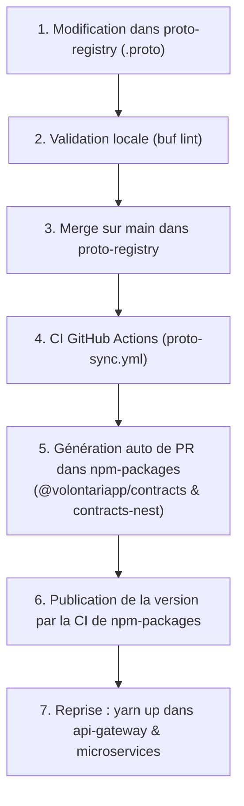

# Proto Contract Evolution & Cycle de Propagation gRPC

Dans Volontariapp, `proto-registry` est l'unique **Source de Vérité (SSOT)** de tous les contrats de communication inter-services synchrones (gRPC).

---

## 1. Avant de modifier un fichier `.proto`

1. **Identifier les consommateurs gRPC en mémoire (MCP Server) :**
   Ne fais pas de recherche plein texte manuelle. Utilise directement l'outil MCP `analyze_grpc` pour localiser en $< 1\text{ms}$ le contrat, les clients dans l'API Gateway et les contrôleurs dans les microservices :
   ```json
   analyze_grpc({ "target": "SignUp" })
   analyze_grpc({ "target": "UserService" })
   ```
2. **Vérification de non-régression de compatibilité binaire :**
   Exécute toujours `buf lint` et `buf breaking` par rapport au dernier commit de `main` :
   ```bash
   buf lint
   buf breaking --against '.git#branch=main'
   ```

---

## 2. Le Cycle de Propagation Automatique (proto-registry -> npm-packages)



> [!CAUTION]
> ### 🛑 RÈGLE BLOQUANTE DU STOP IMMÉDIAT SUR PROTO-REGISTRY
> - Dès que tu as fini de modifier un fichier `.proto` dans `proto-registry` : **TU T'ARRÊTES**.
> - **INTERDICTION FORMELLE** d'aller toucher au code de `api-gateway` ou des microservices `ms-*` en avance.
> - **Pourquoi ?** Parce que le code TypeScript n'est PAS compilé localement : il est généré automatiquement par la CI de `proto-registry` qui crée une Pull Request dans `npm-packages` !
> - **Ce n'est qu'APRÈS** le merge de `proto-registry` sur `main`, la génération de la PR dans `npm-packages`, et la publication effective du nouveau `@volontariapp/contracts` par la CI que tu as le droit de mettre à jour les microservices consommateurs via `yarn up`.

---

## 3. Gestion des Changements Compatibles vs Cassants

- **Changements additifs (Rétrocompatibles) :**
  - Ajout d'un nouveau champ optionnel avec un nouveau tag protobuf (ex: `string bio = 5;`).
  - Ajout d'une nouvelle méthode `rpc`.
  - Ces changements peuvent être déployés sans risque de rupture d'exécution.
- **Changements cassants (Breaking Changes) :**
  - Renommage ou suppression d'un champ existant.
  - Changement de numéro de tag d'un champ.
  - Changement de type d'un champ (ex: `int32` -> `string`).
  - **Ordre de déploiement obligatoire :** Les consommateurs (API Gateway, MS) doivent d'abord cesser de lire/écrire le champ avant que celui-ci ne soit définitivement retiré de `proto-registry`.

---

## 4. Règles d'Or

- [ ] **Ne JAMAIS renuméroter un tag existant** sous prétexte de "nettoyer" la numérotation des champs protobuf (cela corrompt la désérialisation binaire wire gRPC).
- [ ] **Toujours vérifier `buf breaking`** avant de soumettre une modification de schéma.
- [ ] **Respecter la cascade :** `proto-registry` $\rightarrow$ PR dans `npm-packages` $\rightarrow$ publication NPM $\rightarrow$ microservices consommateurs.
