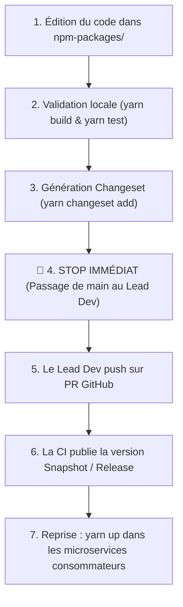

# Shared NPM Package Change & Règle d'Or du Stop Immédiat

Le répertoire `npm-packages/packages/` contient l'ensemble du code partagé entre microservices et leurs processus satellites :
- **Packages de domaine (`domain-<domaine>`)** : partagés entre `ms-<domaine>`, `outbox-<domaine>`, `worker-<domaine>` et `post-processors-runner`.
- **Packages transverses (`messaging`, `contracts`, `database`, `auth`, `logger`, `errors`, `monitoring`)** : consommés par l'ensemble des 17 dépôts.

---

## 🛑 RÈGLE D'OR ABSOLUE : LE STOP IMMÉDIAT

> [!CAUTION]
> **DÈS QUE TU AS TERMINÉ DE MODIFIER QUOI QUE CE SOIT DANS `npm-packages` :**
> 1. Tu vérifies localement la compilation : `yarn build` (et `yarn test`).
> 2. Tu crées le changeset nécessaire : `yarn changeset add`.
> 3. **TU T'ARRÊTES IMMÉDIATEMENT**. Tu ne touches à AUCUN autre fichier ou repository.
> 4. **INTERDICTION FORMELLE** d'aller modifier, tester ou compiler les microservices consommateurs (`ms-*`, `api-gateway`, runners) en avance.
> 5. **INTERDICTION FORMELLE** de bricoler des types, d'utiliser du casting `as unknown as Type`, ou de poser du `any` pour faire semblant que le code compile sans le paquet publié.
> 6. **ACTION EXIGÉE** : Tu passes la main au Lead Dev. Tu lui indiques que les modifications dans `npm-packages` sont prêtes et tu **ATTENDS qu'il pousse sur une PR**.
> 7. La CI GitHub Actions s'exécute sur la PR et génère une version snapshot temporaire (ex: `@volontariapp/messaging@0.9.1-snapshot-pr-42`) ou définitive sur `main`.
> 8. **Ce n'est qu'APRÈS la publication effective par la CI** que tu pourras mettre à jour les dépendances dans les microservices consommateurs (`yarn up @volontariapp/<pkg>@<version>`).

---

## 1. Avant de modifier un package partagé (Impact Analysis)

Ne jamais modifier un package à l'aveugle :
1. **Mesurer le rayon d'impact** : Utilise l'outil MCP `find_dependents` pour identifier en $O(1)$ tous les fichiers et services qui importent le package ou symbole modifié :
   ```json
   find_dependents({ "target": "@volontariapp/messaging" })
   find_dependents({ "target": "UserAuthRequest" })
   ```
2. **Pour les flux asynchrones** : Si tu modifies un événement ou un job dans `messaging`, utilise l'outil MCP `analyze_impact` pour visualiser les producteurs, consommateurs et sagas impactés :
   ```json
   analyze_impact({ "target": "USER_CREATED" })
   ```

---

## 2. Déroulement du Workflow Pas-à-Pas



1. **Édition locale** : Modifications ciblées dans `npm-packages/packages/<package>`.
2. **Build & Tests** : Vérifier que `yarn build` passe sans aucune erreur.
3. **Changeset** :
   - Exécuter `yarn changeset add` et sélectionner les packages modifiés.
   - Ne JAMAIS bumper deux fois le même package sur la même branche (ex: pas de 3.1 -> 3.3).
4. **🛑 STOP TOTAL** : Arrêt de toute exécution. Informer le Lead Dev que le package est prêt pour la PR.
5. **Attente de publication** : Attendre le retour de la CI avec la version snapshot ou définitive.
6. **Consommation** : Reprendre dans les microservices concernés via `yarn up @volontariapp/<package>@<version-snapshot>` et adapter le code consommateur.

---

## 3. Lien avec `proto-registry`

- Si ta modification de contrat prend sa source dans des fichiers `.proto` (dans `proto-registry`), la chaîne est asynchrone :
  1. Modification dans `proto-registry`.
  2. Merge sur `main` dans `proto-registry`.
  3. La CI de `proto-registry` ouvre/met à jour automatiquement une PR dans `npm-packages` pour régénérer `@volontariapp/contracts` et `@volontariapp/contracts-nest`.
  4. Cette PR dans `npm-packages` doit être mergée et publiée par la CI.
  5. **Tu ne dois JAMAIS tenter de toucher aux microservices avant que toute cette boucle ne soit terminée !**
