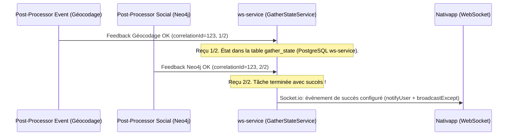

# Deep-Dive : Étape 4 - Scatter-Gather & Passerelle WebSocket (`ws-service`)

Ce document détaille l'orchestration du pattern **Scatter-Gather** et la notification en temps réel vers le client mobile/web dans `ws-service`.

---

## 1. Qu'est-ce que le Scatter-Gather ?

Lorsqu'une action utilisateur nécessite plusieurs opérations asynchrones indépendantes (ex: Création d'événement = Géocodage + Ingestion Neo4j) :

- **Scatter (Éparpillement)** : Le microservice émet un seul événement. Deux (ou plus) post-processors indépendants l'exécutent en parallèle.
- **Gather (Rassemblement)** : Le `ws-service` écoute les flux de retour de chaque processeur, agrège les résultats pour un même `correlationId`, et ne prévient l'utilisateur qu'une fois la totalité des tâches terminée.



---

## 2. Le Rôle du `GatherStateService` dans `ws-service` (vérifié le 2026-10-06)

`ws-service/src/core/services/gather-state.service.ts`[^gather-state] persiste l'état dans la table PostgreSQL **`gather_state`** de `ws-service` (`trigger_event`, `gather_events_state` en jsonb, métadonnées du déclencheur). Il n'y a ni compteur Redis ni TTL : la version « clé `gather:<id>` à 60 s » de `docs/C3` est obsolète.

| Méthode | Rôle |
| :--- | :--- |
| `getAggregationConfig(trigger)` | Lit `scatterGather.aggregations` dans la configuration de `ws-service` : retours attendus, `successEvent`, `failureEvent` |
| `initializeGatherState(correlationId, triggerEvent, metadata)` | Crée l'état à la réception de l'événement déclencheur, avec `emitterId`, `traceId` et le payload |
| `updateEventState(correlationId, expectedKey, status, errorReason?)` | Marque un retour attendu `SUCCESS` ou `FAILED` ; renvoie `isComplete`, `isSuccess`, `failedEvents` |

---

## 3. Implémentation d'un post-processor de gather

Deux classes de base dans `ws-service/src/post-processors/`[^base] :

- `BaseGatherPostProcessor` : `isCreator = true` pour celui qui écoute le déclencheur (initialise l'état), `false` pour ceux qui écoutent un retour (mettent à jour l'état).
- `BaseWebSocketGatherPostProcessor` : retour non créateur qui, à la complétion, choisit `successEvent` ou `failureEvent`, le traduit en événement WebSocket (`getWsEventForEvent`), puis `notifyUser(emitterId, ...)` et, en cas de succès, `broadcastExcept(emitterId, ...)`.

Exemple réel, le retour « géocodage réussi » de la création d'événement[^geocoded] :

```typescript
@Injectable()
export class GeocodedSuccessPostProcessor extends BaseWebSocketGatherPostProcessor<
  EventEventMessagingType.EVENT_GEOCODED,
  EventEventMessagingType.EVENT_CREATED
> {
  constructor(
    redisClient: Redis,
    options: PostProcessorOptions,
    notificationService: NotificationService,
    gatherStateService: GatherStateService,
  ) {
    super(
      redisClient,
      options,
      gatherStateService,
      notificationService,
      EventEventMessagingType.EVENT_CREATED, // déclencheur du gather
      'GEOCODED_SUCCESS',                    // clé attendue dans scatterGather.aggregations
      EventStatus.SUCCESS,
    );
  }

  protected override shouldProcess(eventType: EventEventMessagingType | string): boolean {
    return eventType === EventEventMessagingType.EVENT_GEOCODED.toString();
  }
}
```

Le stream écouté est déclaré dans le fichier d'options voisin (`options/*.options.ts`, `streamName: getEventStreamName(Streams.X)`), et le provider est enregistré dans `post-processors.module.ts`. Ajouter un retour attendu, c'est donc : une clé dans `scatterGather.aggregations`, une classe comme ci-dessus, son fichier d'options, son enregistrement.

---

## 4. Sécurité WebSocket & Authentification Interne

Rappel issu de C2-Containers.md (`docs/C2-Containers.md`) :
- Le `ws-service` n'est **jamais exposé directement** sur Internet.
- L'**API Gateway** intercepte les requêtes de handshake (`/socket.io`), valide le JWT OAuth, et injecte un header `x-internal-token`.
- Le `ws-service` vérifie ce token interne de façon purement cryptographique (ultra-rapide, zéro requête BDD) et associe la socket à l'`userId`.

[^gather-state]: GatherStateService
[^base]: BaseWebSocketGatherPostProcessor
[^geocoded]: GeocodedSuccessPostProcessor
