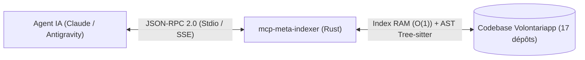

# Volontariapp

[](https://www.typescriptlang.org/)
[](https://www.rust-lang.org/)
[](https://nestjs.com/)
[](https://reactnative.dev/)
[](https://www.postgresql.org/)
[](https://neo4j.com/)
[](https://redis.io/)
[](https://kubernetes.io/)

Le méta-répertoire modulaire qui propulse la plateforme **Volontariapp** — connectant les bénévoles aux organisations.

---

## Architecture du Méta-Projet

Ce dépôt ("umbrella repository") centralise l'écosystème distribué de Volontariapp. 
Chaque microservice (API, Workers, Post-Processors), l'application mobile (`nativapp`), les librairies partagées (`npm-packages`), le registre Protobuf (`proto-registry`), l'indexeur IA (`mcp-meta-indexer`) et la documentation d'architecture (`docs`) sont des dépôts GitHub indépendants. 

Cette approche garantit un versioning et des pipelines CI/CD découplés, tout en offrant une expérience développeur unifiée en local grâce à nos scripts d'orchestration.

> 📚 **Documentation Officielle d'Architecture (Modèle C4)** : 
> Toute la documentation technique, la modélisation C4 (System Context, Containers, Async Patterns, Infrastructure) et les guides de flux sont hébergés dans le dépôt dédié **[Volontariapp/docs](https://github.com/Volontariapp/docs)** (ou consultables localement dans le sous-dossier [`./docs`](docs/README.md)).

---

## Documentation d'Architecture (Modèle C4)

La documentation de référence est structurée selon le modèle **C4** pour une compréhension progressive du système :

| Document | Objet | Description |
| :--- | :--- | :--- |
| **[C1 - System Context](docs/C1-System-Context.md)** | Vue Macro | Acteurs (Bénévoles, Associations), frontières du système et intégrations tierces. |
| **[C2 - Containers](docs/C2-Containers.md)** | Topologie | Microservices NestJS (gRPC), bases PostgreSQL dédiées, Neo4j, Redis et API Gateway. |
| **[C3 - Async Patterns & Flows](docs/C3-Async-Patterns-And-Flows.md)** | Événements & Sagas | Transactional Outbox, Redis Streams, BullMQ, Post-Processors, compensations de sagas et Scatter-Gather WebSocket. |
| **[C4 - Deployment & Infrastructure](docs/C4-Deployment-And-Infrastructure.md)** | GitOps & K8s | Cluster Kubernetes, ArgoCD, Sealed Secrets, Network Policies et sidecar git-sync. |
| **[Structure Monorepo & NPM](docs/Monorepo-Structure.md)** | Contrats & Domaines | Mutualisation par `@volontariapp/domain-*`, `@volontariapp/contracts`, `@volontariapp/contracts-nest`. |

---

## Intelligence Artificielle & Serveur MCP (`mcp-meta-indexer`)

Pour permettre aux agents d'IA (Claude Code, Antigravity, Cursor) de naviguer et de raisonner sur tout les dépôts sans saturer leur contexte en tokens, le projet intègre **[`mcp-meta-indexer`](mcp-meta-indexer/README.md)**, un serveur haute performance écrit en **Rust** implémentant le standard **Model Context Protocol (MCP)**.



### Les 5 Outils Exposés

1. 🔍 **`smart_search`** : Recherche plein texte Ripgrep combinée à un parser **Tree-sitter (AST)**. Extrait le bloc syntaxique exact et le squelette architectural du fichier (~90% d'économie de tokens), avec **fallback Fuzzy Matching** automatique en cas d'imprécision lexicale.
2. 🕸️ **`find_dependents`** : Graphe des imports en mémoire vive. Résolution instantanée en $O(1)$ des consommateurs d'un symbole, contrat ou package partagé.
3. ⚡ **`analyze_impact`** : Cartographie causale de l'architecture événementielle (CQRS, Transactional Outbox, Redis Streams, BullMQ, Post-processors, triades de sagas Commit/Rollback, et broadcasts WebSocket).
4. 🌐 **`analyze_grpc`** : Cartographie synchrone de bout en bout des flux gRPC (spécifications `.proto` dans `proto-registry`, DTOs Gateway front, interfaces NestJS et contrôleurs `@GrpcMethod`).
5. 📚 **`search_docs`** : Recherche ciblée et extraction de sections conceptuelles dans le repo `docs` (~200 tokens par concept extrait).

### Utilisation & Configuration
- **En local (Stdio) :** Compilé via `cargo build --release` dans `mcp-meta-indexer/` et branché directement sur votre client MCP.
- **Sur Kubernetes (SSE HTTP) :** Déployé sous forme de Pod sur le port 3000 avec le sidecar `git-sync` pour une synchronisation temps réel de la codebase.
- **Documentation complète :** Consultez le [README mcp-meta-indexer](mcp-meta-indexer/README.md) et la documentation technique dans [mcp-meta-indexer/docs/](mcp-meta-indexer/docs/).

---

## Tech Stack

| Layer | Technology | Rôle / Usage |
|---|---|---|
| **Runtime Backend** | Node.js (24.14.0 LTS) | Moteur d'exécution asynchrone TypeScript. |
| **Indexation IA** | Rust (1.80+) | Serveur MCP haute performance (`mcp-meta-indexer`). |
| **Package Manager** | Yarn (4.12.0 Berry) | Gestion stricte des dépendances via Workspaces. |
| **Backend API & MS** | NestJS (11.x) | Microservices modulaires communicant en gRPC. |
| **Backend Satellites** | NestJS Standalone | Daemons `outbox-runners`, `workers-runners`, `post-processors-runner`. |
| **Mobile** | React Native (Expo 54) | Application mobile unifiée (iOS / Android). |
| **Real-Time** | Socket.io + Redis | Passerelle WebSockets avec adapter Pub/Sub scatter-gather. |
| **Persistance SQL** | PostgreSQL (TypeORM) | 1 base de données dédiée par microservice (ACID). |
| **Graphe Relationnel** | Neo4j | Base graphe pour `ms-social` (abonnements, réseau). |
| **Event Broker** | Redis Streams | Bus d'événements persistant (Transactional Outbox). |
| **Job Queue** | Redis (BullMQ) | Files d'attente asynchrones pour tâches lourdes. |
| **Déploiement GitOps** | K3s + ArgoCD | Kubernetes, Sealed Secrets, Network Policies. |

---

## Écosystème des Dépôts (Repositories)

Tous les services sont hébergés dans l'organisation GitHub **[Volontariapp](https://github.com/Volontariapp)** :

### Documentation & Outils IA
- [**docs**](https://github.com/Volontariapp/docs) : Référentiel officiel de la documentation d'architecture C4, ADRs et guides techniques.
- [**mcp-meta-indexer**](https://github.com/Volontariapp/mcp-meta-indexer) : Serveur MCP Rust pour l'indexation AST et l'analyse causale de la codebase.

### Points d'Entrée & Clients
- [**nativapp**](https://github.com/Volontariapp/nativapp) : Application mobile React Native (Expo).
- [**api-gateway**](https://github.com/Volontariapp/api-gateway) : Passerelle HTTP / REST, validation JWT et routage vers les microservices gRPC.
- [**ws-service**](https://github.com/Volontariapp/ws-service) : Passerelle temps réel WebSocket (Pub/Sub, notifications mobiles).

### Microservices Métiers (gRPC)
- [**ms-user**](https://github.com/Volontariapp/ms-user) : Identité, authentification et profils utilisateurs.
- [**ms-event**](https://github.com/Volontariapp/ms-event) : Cœur métier, missions, événements et participations.
- [**ms-post**](https://github.com/Volontariapp/ms-post) : Fil d'actualités, publications et commentaires.
- [**ms-social**](https://github.com/Volontariapp/ms-social) : Relations sociales et recommandations (Neo4j).
- [**ms-storage**](https://github.com/Volontariapp/ms-storage) : Gestion des médias et stockage objet.

### Infrastructure Asynchrone (Event-Driven)
- [**outbox-runners**](https://github.com/Volontariapp/outbox-runners) : Daemons d'extraction transactionnelle PostgreSQL vers Redis Streams.
- [**workers-runners**](https://github.com/Volontariapp/workers-runners) : Consommateurs de tâches asynchrones BullMQ.
- [**post-processors-runner**](https://github.com/Volontariapp/post-processors-runner) : Traitement des flux Redis Streams, clôture de sagas et notifications.

### Outillage & Déploiement
- [**npm-packages**](https://github.com/Volontariapp/npm-packages) : Monorepo des librairies `@volontariapp/*` (contrats, domaines, shared).
- [**proto-registry**](https://github.com/Volontariapp/proto-registry) : Registre unique des contrats Protocol Buffers (SSOT gRPC).
- [**deploy**](https://github.com/Volontariapp/deploy) : Source de vérité GitOps pour Kubernetes (K3s, ArgoCD).
- [**ci-tools**](https://github.com/Volontariapp/ci-tools) : Actions et workflows GitHub Actions partagés.
- [**changelog-checker**](https://github.com/Volontariapp/changelog-checker) : Outil de validation automatisée des versions et changelogs.

---

## Quick Start & Setup

Le point d'entrée central du méta-projet est le script interactif **`root.sh`**.

### 1. Installation Initiale (Full Setup)

Pour initialiser l'ensemble de l'environnement de développement :

```bash
bash root.sh
# Sélectionnez l'option 1) Full Setup
```
Cette commande automatise :
- L'installation de Node.js, Yarn Berry (Corepack) et des outils locaux.
- Le clonage et l'initialisation de **tous les dépôts** de l'organisation.
- L'installation des dépendances transverses.

### 2. Démarrage Quotidien (Dev Mode)

Exécutez `bash root.sh` et choisissez l'option de démarrage souhaitée :
- **`11) Dev All`** : Démarre l'ensemble des microservices, l'API Gateway, les runners et l'application mobile.
- **`13) Dev Backend`** : Démarre uniquement la stack serveur backend.
- **`15) Dev Microservices`** : Démarre uniquement les microservices gRPC synchrones.

*Raccourci direct sans passer par le menu :*
```bash
echo 11 | ./root.sh
```

### 3. Synchronisation des Dépôts

Pour récupérer les dernières modifications de tous les dépôts rebasées sur `main` :
```bash
bash scripts/sync-repos.sh
```

---

## Standards du Projet & Règles d'Or

- **Clean Architecture & DDD** : Séparation stricte entre domaine métier, application et infrastructure.
- **TypeScript Strict** : Typage exhaustif avec interdiction formelle du `any`.
- **Règle du Stop Immédiat (`npm-packages`)** : Toute modification d'un contrat ou package partagé nécessite une publication par la CI avant de modifier les services consommateurs.
- **Transactional Outbox & Sagas** : Aucune mutation distribuée directe entre microservices ; passage obligatoire par l'outbox et les événements chorégraphiés.
- **Conventional Commits** : Préfixes `feat:`, `fix:`, `chore:`, `docs:`, `refactor:`.

---

## License

MIT — Proprietary software. All rights reserved.
