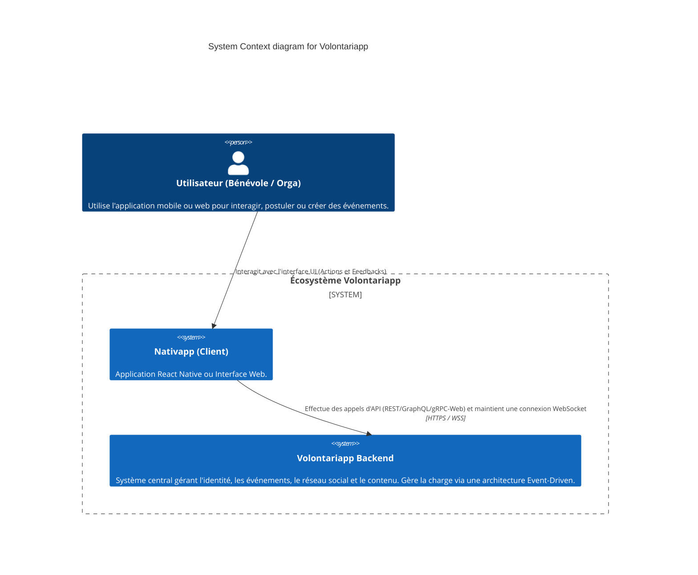

# C1 - System Context (Vue Macro)

L'architecture de Volontariapp a été conçue pour supporter une charge applicative massive tout en garantissant une expérience utilisateur sans latence, grâce à une séparation stricte entre les requêtes synchrones et les traitements asynchrones.

Le **System Context** (Niveau 1 du modèle C4) représente Volontariapp comme une boîte noire, mettant en évidence la manière dont les utilisateurs et les systèmes externes interagissent avec la plateforme.

## Le Diagramme de Contexte

## Description des Composants

### 1. Les Acteurs (Users)
Les utilisateurs de Volontariapp se divisent principalement en deux catégories (Bien qu'ils utilisent le même système) :
- **Les Bénévoles** : Cherchent des événements, s'abonnent à des organisations, et consomment le fil d'actualités.
- **Les Organisateurs** : Créent des événements, gèrent les participations, publient du contenu.

### 2. Le Client (Frontend / Nativapp)
Le point de contact direct avec l'utilisateur. Le client est "bête" (dumb client) : il n'exécute pas de logique métier complexe.
- Il déclenche une action HTTP asynchrone (ex: "Créer un événement").
- Il passe immédiatement dans un **Status: Pending** visuel (Affichage de chargement).
- Il écoute activement le **ws-service** (WebSockets) pour recevoir un feedback du serveur ("Succès" ou "Erreur") qui lui permettra de passer à l'état **Done**.

### 3. Volontariapp Backend (La Boîte Noire)
C'est le cœur du système, que nous allons ouvrir dans le document **[C2 - Containers](C2-Containers.md)**.
À ce niveau d'abstraction, le backend est responsable de :
- L'authentification et l'autorisation.
- La validation stricte des règles métiers (Domain-Driven Design).
- L'enregistrement persistant des données.
- La propagation asynchrone de l'information (Event-Driven) pour garantir que l'utilisateur n'attend jamais plus de quelques millisecondes (latence réseau pure) pour qu'une requête HTTP soit acquittée, même si le traitement en arrière-plan (ex: Géocodage, création des graphes sociaux) prend plusieurs secondes.
