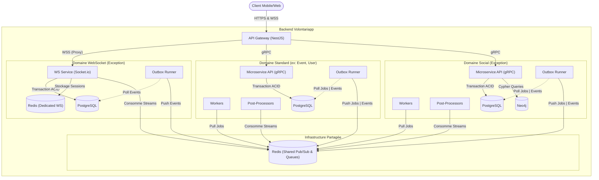

# C2 - Containers (L'Intérieur de la Boîte Noire)

Le niveau "Containers" décompose le backend Volontariapp en ses principales briques d'infrastructure et d'exécution. 

L'architecture est fondamentalement basée sur un modèle de **Microservices Hautement Découplés** combiné à une approche **Event-Driven**. Pour garantir la résilience, chaque domaine (ex: User, Event, Post) possède sa propre pile d'exécution isolée, mais partage un bus de messagerie commun.

## Le Paradigme : "Isolé" vs "Partagé"

Une des règles d'or de l'architecture Volontariapp est la distinction entre ce qui appartient en propre à un domaine (Isolé) et ce qui sert de liant à la plateforme (Partagé).

### 1. Le Périmètre Isolé (L'Anatomie Type d'un Domaine)
À l'exception de quelques cas particuliers, tous les domaines métiers standards (ex: `ms-event`, `ms-user`, `ms-post`) possèdent une pile d'exécution standardisée et **totalement isolée** (ils ont leur propre dépôt Git, leur propre processus Node.js, et ne partagent pas leur mémoire ni leur base de données) :
- **Le Microservice API (ex: `ms-event`)** : Expose des contrats gRPC, exécute la logique métier.
- **La Base de Données (PostgreSQL)** : Chaque domaine possède sa propre base relationnelle.
- **L'Outbox Runner (`outbox-runners`)** : Un daemon Lean Node.js qui extrait les événements métier persistés de la base de données.
- **Les Workers (`workers-runners`)** : Exécutent les tâches asynchrones lourdes spécifiques au domaine.
- **Les Post-Processors (`post-processors-runner`)** : Consomment les Redis Streams pour finaliser les Sagas ou le nettoyage.

**Les Exceptions (Domaines Spécifiques) :**
- **Le Domaine Social (`ms-social`)** : Possède exactement la même structure (Postgres, Outbox, Workers, Post-Processors), mais intègre **en plus** une base de données **Neo4j** propre pour les algorithmes de graphe.
- **Le Domaine WebSocket (`ws-service`)** : Possède sa propre base PostgreSQL et son `outbox-ws`. En revanche, il n'a **pas** de Workers et pas de Post-Processors externes. Il possède un **Redis Dédié** (`db_redis_ws`) en plus du Redis partagé, exclusivement pour gérer le state de ses sessions éphémères.

### 2. Le Périmètre Partagé
Ces composants sont l'infrastructure commune qui permet aux domaines de communiquer sans couplage fort :
- **Redis (Shared)** : Le courtier de messages principal. Il est le seul élément d'infrastructure de données partagé. Il héberge les files d'attente **BullMQ** (pour les Workers) et les **Redis Streams** (pour l'Event-Driven / Post-Processors).
- **Le code métier (`domain_npm`)** : Hébergé dans le monorepo `npm-packages`, il garantit que tous les services isolés d'un même domaine parlent le même langage métier (Entités, Value Objects).

## Diagramme des Containers (C2)

## Le Rôle de l'API Gateway : Gardien du Temple

L'**API Gateway** est le seul composant exposé sur Internet (via l'Ingress Kubernetes). 
Son rôle est de protéger le système interne en gérant deux flux principaux :

### 1. La Communication Synchrone (HTTP -> gRPC)
1. Il intercepte le Token JWT (fourni par Auth0, Firebase ou un provider interne).
2. Il valide l'authentification et génère un **Token Interne** signé, injecté dans les headers gRPC.
3. Il route la requête vers le bon Microservice (`ms-user`, `ms-event`, etc.) via **gRPC**.

### 2. Le Proxy WebSocket (WS -> WS)
Le `ws-service` n'est pas exposé directement sur Internet. 
1. L'API Gateway intercepte les requêtes d'upgrade WebSocket (vers `/socket.io`).
2. Il valide le Token d'accès (JWT).
3. S'il est valide, il génère un **Token Interne** qu'il injecte dans les headers de la requête proxy (`x-internal-token`).
4. Il transfère (proxy) la connexion TCP vers le `ws-service`.

> [!NOTE]
> Le `ws-service` délègue ainsi la complexité de l'authentification OAuth à la Gateway. Il n'a plus qu'à vérifier cryptographiquement le "Token Interne" (extrêmement rapide, sans appel BDD) pour autoriser le client et tracker sa socket. Les appels gRPC fonctionnent sur le même principe.

> [!TIP]
> La communication entre l'API Gateway et les Microservices est **synchrone** et ultra-rapide (gRPC). Cependant, dès qu'un Microservice reçoit la requête, il ne fait qu'une validation métier rapide et une insertion en base de données, avant de répondre immédiatement au Gateway. Tout le reste du travail "lourd" est délégué à la tuyauterie asynchrone détaillée dans le niveau **C3**.
