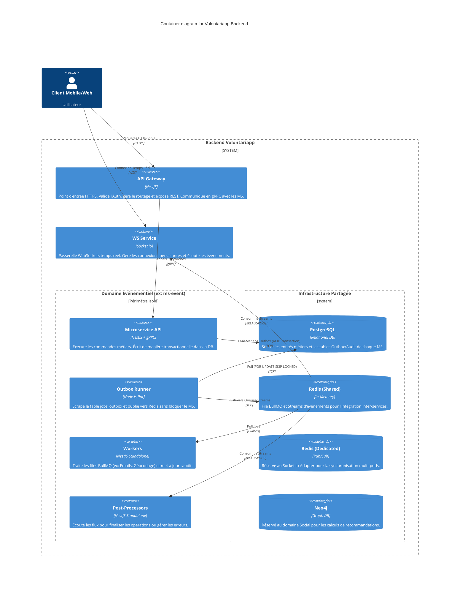

# C2 - Containers (L'Intérieur de la Boîte Noire)

Le niveau "Containers" décompose le backend Volontariapp en ses principales briques d'infrastructure et d'exécution. 

L'architecture est fondamentalement basée sur un modèle de **Microservices Hautement Découplés** combiné à une approche **Event-Driven**. Pour garantir la résilience, chaque domaine (ex: User, Event, Post) possède sa propre pile d'exécution isolée, mais partage un bus de messagerie commun.

## Le Paradigme : "Isolé" vs "Partagé"

Une des règles d'or de l'architecture Volontariapp est la distinction entre ce qui appartient en propre à un domaine (Isolé) et ce qui sert de liant à la plateforme (Partagé).

### 1. Le Périmètre Isolé (Par Domaine)
Pour un domaine donné (ex: le domaine "Event"), les composants suivants sont **totalement isolés** (ils ont leur propre dépôt Git, leur propre processus Node.js, et ne partagent pas leur mémoire) :
- **Le Microservice API (`ms-event`)** : Expose des contrats gRPC, exécute la logique métier.
- **L'Outbox Runner (`outbox-runners`)** : Un daemon Lean Node.js qui extrait les événements métier persistés.
- **Les Workers (`workers-runners`)** : Exécutent les tâches asynchrones lourdes spécifiques au domaine.
- **Les Post-Processors (`post-processors-runner`)** : Consomment les Redis Streams pour finaliser les Sagas ou le nettoyage.

### 2. Le Périmètre Partagé
Ces composants sont l'infrastructure commune qui permet aux domaines de communiquer sans couplage fort :
- **PostgreSQL** : Bien que déployé sur un même cluster physique/virtuel, chaque microservice possède logiquement sa propre base/schéma. Il est interdit pour `ms-user` de faire une requête SQL sur la base de `ms-event`.
- **Redis (Shared)** : Le courtier de messages principal. Il héberge les files d'attente **BullMQ** (pour les Workers) et les **Redis Streams** (pour l'Event-Driven / Post-Processors).
- **Le code métier (`domain_npm`)** : Hébergé dans le monorepo `npm-packages`, il garantit que tous les services isolés d'un même domaine parlent le même langage métier (Entités, Value Objects).

## Diagramme des Containers (C2)

## Le Rôle de l'API Gateway et la Communication Synchrone

L'**API Gateway** est le seul composant exposé sur Internet (via l'Ingress Kubernetes). 
Son rôle est de protéger le système interne :
1. Il intercepte le Token JWT (fourni par Auth0, Firebase ou un provider interne).
2. Il valide l'authentification et génère un **Token Interne** signé, injecté dans les headers gRPC.
3. Il route la requête vers le bon Microservice (`ms-user`, `ms-event`, etc.) via **gRPC**.

> [!NOTE]
> La communication entre l'API Gateway et les Microservices est **synchrone** et ultra-rapide (gRPC). Cependant, dès qu'un Microservice reçoit la requête, il ne fait qu'une validation métier rapide et une insertion en base de données, avant de répondre immédiatement au Gateway. Tout le reste du travail "lourd" est délégué à la tuyauterie asynchrone détaillée dans le niveau **C3**.
