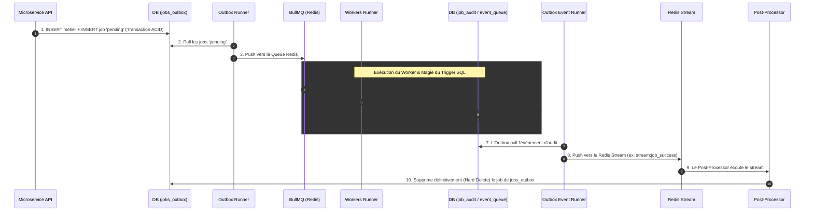

# C3 - Patterns & Flux Asynchrones

Ce document détaille le cœur de la machinerie de Volontariapp. C'est ici que la magie de la scalabilité opère. Si vous ne devez comprendre qu'un seul concept de toute la plateforme, c'est celui-ci : **Ne jamais bloquer une requête HTTP avec une tâche longue.**

## 1. Le Transactional Outbox Pattern (Le "Dual Write Problem")

Dans une architecture distribuée, que se passe-t-il si un Microservice enregistre un événement dans PostgreSQL, puis tente de publier un message dans Redis, mais que Redis crash juste à ce moment-là ? Le message est perdu, le système devient inconsistant. 

**Solution : Transaction ACID + Outbox.**
1. Le Microservice reçoit une requête (via gRPC depuis l'API Gateway).
2. Il ouvre une Transaction SQL.
3. Il insère les données métiers (ex: `INSERT INTO events`).
4. Dans **la même transaction**, il insère un "ticket" dans la table `jobs_outbox` (Status: Pending).
5. Il ferme la transaction (Commit). 
Si Postgres plante, rien n'est écrit. Si ça passe, les deux sont garantis d'être écrits. Le Microservice répond alors "OK" au Gateway.

**L'Outbox Runner** :
Un processus léger (`outbox-runners`) tourne en boucle infinie (Pull).
Il scrute la table `jobs_outbox` (`SELECT ... FOR UPDATE SKIP LOCKED` pour éviter les collisions entre plusieurs pods). Dès qu'il trouve un job *Pending*, il le pousse vers une file Redis (BullMQ).

## 2. Le Cycle de Vie Complet d'un Job et le SQL Trigger

Que devient ce Job une fois dans Redis ? Voici le flux complet de bout-en-bout (Le *Audit Loop*) :

Grâce à ce cycle (Saga Pattern), on garantit qu'un Job n'est effacé de la base d'origine que s'il a été traité jusqu'au bout, audité, et confirmé par le réseau.

## 3. Le Pattern Scatter-Gather (Ex: Création d'un Événement)

Lorsqu'un utilisateur clique sur "Créer un Événement", le frontend affiche un état "Pending" (Spinner). Il ne recevra le feu vert (via WebSocket) que lorsque toutes les sous-tâches auront été accomplies par le backend. 

C'est le **Scatter-Gather**.

1. **Scatter (Éparpillement)** : `ms-event` crée l'événement et pousse un message sur le `stream:event-created`.
2. Plusieurs Post-Processors (indépendants) écoutent ce même stream en parallèle :
   - Le `Post-Processor-Event` va géocoder l'adresse (appel d'une API de cartographie).
   - Le `Post-Processor-Social` va créer l'événement dans le graphe de la base Neo4j.
3. Chaque processeur publie son résultat de son côté sur le flux de feedback (`stream:ws-event-created-feedback`) avec le même **Correlation_ID**.
4. **Gather (Rassemblement)** : Le `ws-service` écoute ces feedbacks. Il sait par configuration qu'il doit attendre **2 réponses** pour cet ID. 
   - Il stocke temporairement l'état (ex: `received: 1/2`).
   - Dès qu'il reçoit `2/2`, il envoie la notification WebSocket de succès (Done) au Frontend.

### Et en cas d'erreur ? (Gestion des Sagas)

Que se passe-t-il si la création dans Neo4j (`ms-social`) réussit, mais que le géocodage (`ms-event`) échoue (ex: Adresse introuvable ou timeout) ?

L'architecture déclenche un flux compensatoire (Compensation Saga) :
1. Le Post-Processor du géocodage émet un événement `EVENT_FAILED` sur le stream.
2. Le `ws-service` rassemble le feedback et constate l'échec. Il notifie immédiatement le client WebSocket avec l'erreur.
3. En parallèle, les autres Post-Processors écoutent le stream d'erreur. Le `Post-Processor-Social` capte cet échec et va **supprimer pro-activement** l'événement orphelin dans Neo4j (Rollback logique).

> [!TIP]
> **Pourquoi le WS-Service écoute-t-il directement les Streams ?**
> Plutôt que de forcer chaque microservice à faire un appel HTTP vers le Gateway ou le WS-Service pour dire "Mon job est fini", on utilise une approche Event-Driven pure. Le WS-Service est autonome et passif ; il observe les bus d'événements et informe le client, court-circuitant l'API Gateway.
