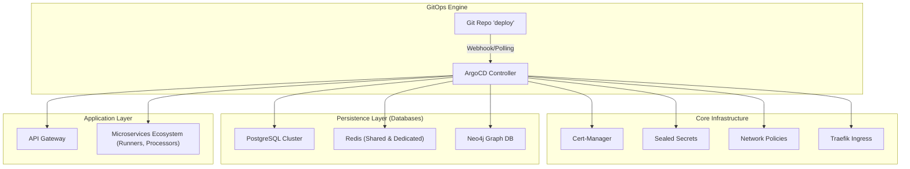

# C4 - Deployment & Infrastructure (GitOps)

Volontariapp a fait le choix d'une infrastructure **GitOps** centralisée. Le dépôt [**deploy**](https://github.com/Volontariapp/deploy) est la Source Unique de Vérité (SSOT) de l'état du cluster.

Toute modification de l'infrastructure de production ne se fait jamais manuellement avec des commandes `kubectl` ; elle passe par une Pull Request sur le dépôt `deploy`. Le contrôleur ArgoCD se charge ensuite de synchroniser l'état du cluster Kubernetes (K3s).

## L'Architecture "App-of-Apps"

L'infrastructure est modulaire. ArgoCD déploie une application racine qui elle-même pointe vers d'autres applications :

## Sécurité & Conformité Zéro-Confiance

Le cluster K3s est hautement sécurisé, adoptant les standards **PSA (Pod Security Admissions) Restricted**.

### 1. Pod Security Standards (PSS)
Tous les namespaces imposent les contraintes suivantes pour empêcher toute élévation de privilège ou compromission du nœud hôte :
- **Non-Root Execution** : Aucun container ne s'exécute en tant que `root` (utilisateur 0).
- **ReadOnly Root Filesystem** : Le système de fichiers est en lecture seule (seuls les dossiers de données ou `/tmp` sont montés en `emptyDir`).
- **No Privilege Escalation** : Interdit par défaut.
- **Seccomp** : Profil `RuntimeDefault` avec effacement de toutes les capabilities (`drop: ["ALL"]`).

### 2. Sealed Secrets (Cryptographie Asymétrique)
Plutôt que de versionner des mots de passe en clair dans Git (ou de s'appuyer sur des variables d'environnement CI peu traçables), Volontariapp utilise **Bitnami Sealed Secrets**.
Les secrets de développement ou de production sont chiffrés localement avec la clé publique du cluster (via `kubeseal`). Seul le contrôleur dans Kubernetes détient la clé privée capable de les déchiffrer en objets `Secret` natifs lors du déploiement.

### 3. Network Policies (Default-Deny)
Une politique stricte de blocage total (Default-Deny) empêche le trafic latéral.
Même au sein du même namespace de production, le microservice `ms-user` ne peut pas contacter la base de données de `ms-social` (`neo4j`). Les flux Egress et Ingress sont explicitement listés par labels. L'accès direct d'un microservice vers l'Internet ouvert est généralement bloqué, excepté pour des appels nécessaires identifiés.

## Résilience : Séquençage de Démarrage (InitContainers)

Dans un cluster Kubernetes massivement parallèle, les bases de données (PostgreSQL, Neo4j) mettent souvent plus de temps à démarrer que les microservices NestJS (surtout les *Standalone Contexts* très rapides).
Pour éviter les crashs en boucle (`CrashLoopBackOff`), chaque déploiement inclut un **InitContainer** (via `busybox`). 
Cet InitContainer "ping" le port TCP de la base de données (ex: `nc -zv ms-social-db-postgresql 5432`) dans une boucle d'attente (Wait-For) avant de laisser le conteneur applicatif principal démarrer.

Cette approche garantit un démarrage propre et une auto-cicatrisation fluide en cas de perte partielle de la couche de persistance.
